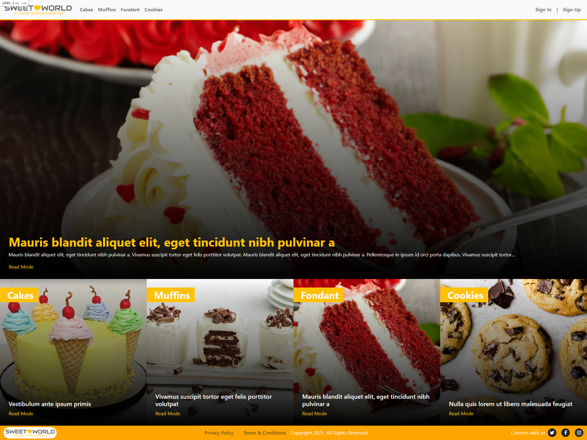
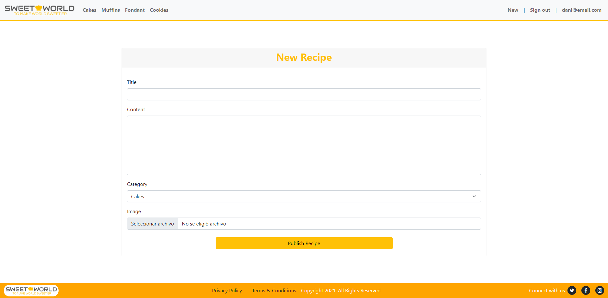
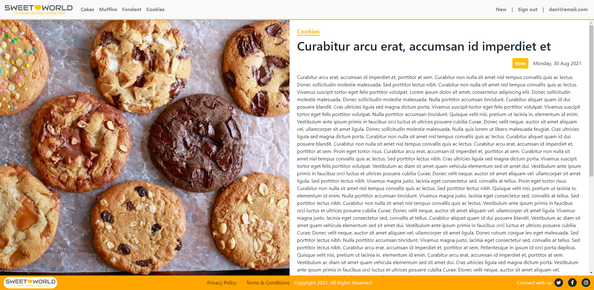
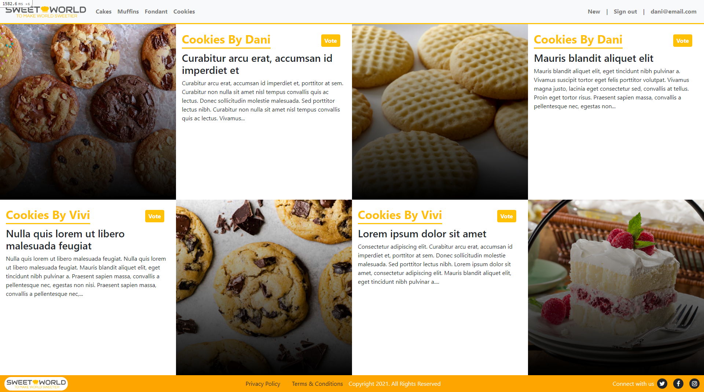

# Sweet World
 

> Web application where users can login, create and vote for sweet recipes.

## Index



>This is the main page, where are listed the most recent recipes in the top 4 priority categories. Also the main article is the most voted article by users.

## New Recipe section


> This is the section where the user can create a new recipe, uploading also the image for the entry.

## View Recipe


> This is how it looks the recipe.

## View category



> List all the recipes by category.


### 👷🏻 Built using
    - Ruby
    - Ruby On Rails
    - Rubocop
    - PostgreSQL
    - Github
    - RubyMine
    - CSS3

### 🌐 Live view

> [Sweet World - To make the world sweeter](https://capstone-rails-kenny.herokuapp.com/)

## 🚩 Getting Started

To get a local copy up and running follow these simple example steps.

### ✅ Prerequisites

* Make sure that **Ruby Environment** is installed in your computer (try to run _ruby_ from your prompt), if not you can install it from [here.](https://www.ruby-lang.org/en/downloads/)


* [Download](https://github.com/kensayo/private-events/archive/refs/heads/development.zip) and unzip **or** [clone this repository](https://docs.github.com/es/github/creating-cloning-and-archiving-repositories/cloning-a-repository)


### 👨🏻‍🔧 Setup

- Open your terminal and move to the root of the project, using ```cd``` command.
- First run ```$ rails webpacker:install```
- You must run ```$ bundle install```
- Then you must run ```$ rails db:create db:migrate```, so you can work locally with the database.
- Start server using ```$ rails s```

### 🔌 Usage

- You can go to http://127.0.0.1:3000/ to use the app locally

### 🛠️ Tests

- You need to migrate the test database with the following command ```rails db:migrate RAILS_ENV=test```
- Then just run ```bundle exec rspec``` in the prompt

## 👨🏻‍💻 Kenny Ortega

- GitHub: [kensayo](https://github.com/kensayo)
- Twitter: [@kensayo](https://twitter.com/kensayo)
- LinkedIn: [LinkedIn](https://www.linkedin.com/in/kennyortega/)


### 🤝🏻 Contributions and issues are welcome!

License
This project is [MIT](./MIT.md) licensed.
